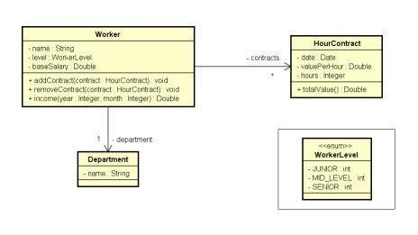
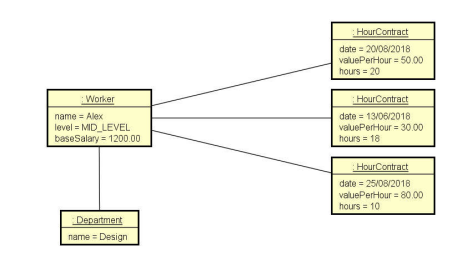

# Composição de Objetos em C#/.NET
<br><br>
# Composição de Objetos
[](https://github.com/rfagner/ComposicaoDeObjetos/blob/main/LICENSE) <br><br>


<br><br>


<br><br>

# Sobre o projeto

Projeto de console que consiste em aplicar os conceitos de Programação Orientada a Objetos (POO) seguindo as orientações abaixo: <br><br>
Ler os dados de um trabalhador com N contratos (N fornecido pelo usuário). Depois, solicitar
do usuário um mês e mostrar qual foi o salário do funcionário nesse mês, conforme exemplo abaixo: <p align="center">
    
</p><br><br><br>

Objetos na memória:<br><br>
<p align="center">
    
</p> <br><br>


# Tecnologias usadas
- .NET 5<br><br>

# Como executar o projeto

Pré-requisitos: .NET 5

```bash
# clonar repositório
git clone https://github.com/rfagner/ComposicaoDeObjetos

# entrar na pasta do projeto DesafioBRQ
cd ComposicaoDeObjetos

# executar o projeto
dotnet run

``` 
<br><br>
# Autor

Renildo Fagner dos Santos de Assis

https://www.linkedin.com/in/rfagner/
